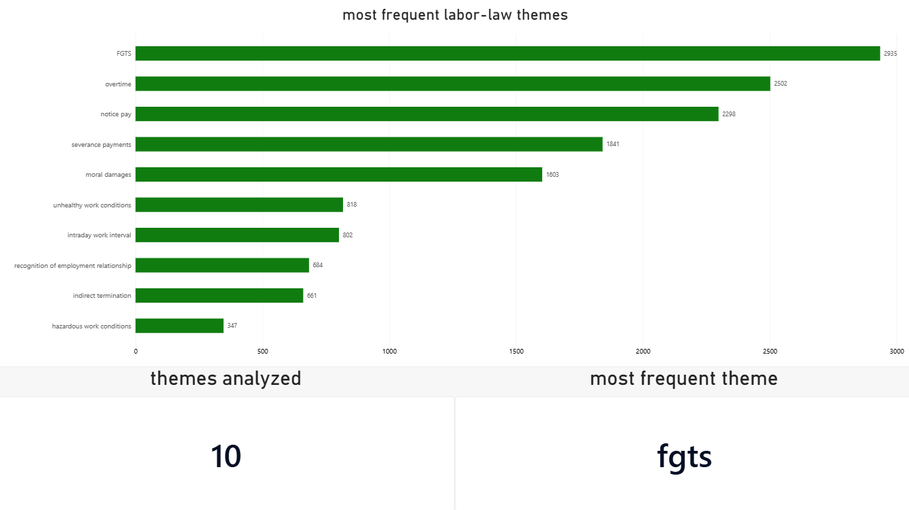
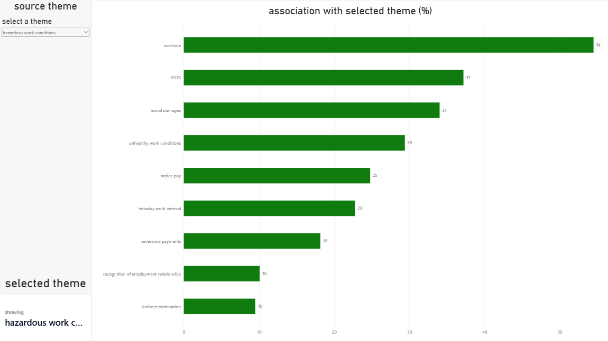
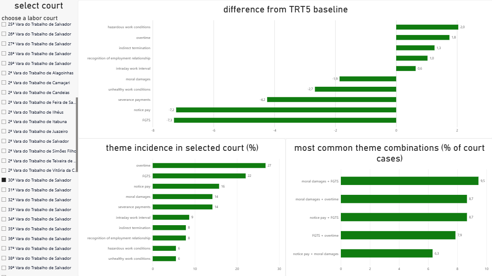

# labor law claims analysis

i wanted to build something with legal data - obrigado, clarinha - that was actually useful beyond just showing a few charts.

so this project started with a pretty simple question:

**if a labor claim contains x, what usually appears with it?**

from there, the idea grew into a legal analytics exploration project using public labor court data from brazil.

the data comes from the public datajud API, maintained by the conselho nacional de justiça (CNJ), and the current version focuses on 10,000 first-degree cases from TRT5, the labor court of Bahia.

the final project combines Python, PostgreSQL, SQL and Power BI to explore recurring labor-law subjects, associations between claims and statistical differences between labor courts.

---

## what i'm trying to answer

instead of throwing random charts at the dataset, i started with questions i could actually imagine someone in the legal field asking:

* which labor-law subjects appear the most?
* if a case has a certain subject, what usually appears with it?
* which claims tend to show up together?
* what does the statistical profile of a specific labor court look like?
* which themes appear more or less frequently in a court compared with the trt5 baseline?
* which combinations of themes are especially common inside a specific court?

basically, i'm trying to turn a giant pile of procedural metadata into something easier to explore.

---

## dashboard

the final Power BI dashboard has three main pages:

### overview

a general look at the ten analytical themes and how often they appear in the dataset.



### association explorer

pick a starting theme and explore what usually appears with it in the same cases.



### court dna

pick a labor court and explore its statistical subject profile, how it differs from the trt5 baseline and which combinations are most common there.



---

## project status

the main version of the project is complete.

the pipeline currently:

* connects to the datajud API
* collects public first-degree trt5 process metadata
* cleans and prepares the data with python
* normalizes labor-law subjects
* creates custom analytical themes
* measures subject frequency
* calculates claim co-occurrence
* calculates directional associations between themes
* loads the processed dataset into postgresql
* performs reusable sql analysis
* creates power bi-ready analytical views
* builds court-level statistical profiles
* compares courts with the trt5 baseline
* identifies frequent theme combinations by court
* powers an interactive three-page power bi dashboard

---

## stack

`python` `pandas` `requests` `postgresql` `sql` `power bi` `dax`

---

## data source

the project uses public procedural metadata from the datajud API, provided by the conselho nacional de justiça.

the current analytical dataset contains:

**10,000 first-degree cases from TRT5**

the process-level datasets are generated locally instead of being stored in the repository.

to collect the data:

```bash
python src/collect_data.py
```

---

## the themes i'm looking at

i selected ten analytical themes:

* overtime
* moral damages
* unhealthy work conditions
* hazardous work conditions
* recognition of employment relationship
* indirect termination
* severance payments
* fgts
* notice pay
* intraday work interval

these are analytical categories constructed from the procedural subjects available in datajud.

---

## what shows up the most?

among the 10,000 collected cases:

| theme | cases | share of dataset |
|---|---:|---:|
| fgts | 2,935 | 29.35% |
| overtime | 2,502 | 25.02% |
| notice pay | 2,298 | 22.98% |
| severance payments | 1,841 | 18.41% |
| moral damages | 1,603 | 16.03% |
| unhealthy work conditions | 818 | 8.18% |
| intraday work interval | 802 | 8.02% |
| recognition of employment relationship | 684 | 6.84% |
| indirect termination | 661 | 6.61% |
| hazardous work conditions | 347 | 3.47% |

this gives some context about the dataset, but frequency alone wasn't really the part i was interested in.

---

## if i have x, what usually comes with it?

this became the main idea behind the project.

instead of asking only how often a theme appears, the association explorer asks:

**if a case contains theme x, what else tends to appear in those same cases?**

for example, using `moral damages` as the starting theme:

| associated theme | share of moral damages cases |
|---|---:|
| overtime | 44.85% |
| fgts | 44.35% |
| notice pay | 29.63% |
| severance payments | 25.83% |
| intraday work interval | 20.59% |
| unhealthy work conditions | 15.35% |
| indirect termination | 12.98% |
| recognition of employment relationship | 10.92% |
| hazardous work conditions | 7.36% |

so:

**44.85% of the cases in this dataset that contain moral damages also contain overtime.**

some other associations i found interesting:

| starting theme | associated theme | association |
|---|---|---:|
| intraday work interval | overtime | 75.94% |
| notice pay | fgts | 69.32% |
| recognition of employment relationship | fgts | 56.73% |
| indirect termination | fgts | 46.90% |

direction matters here.

`notice pay -> fgts`

is not the same question as:

`fgts -> notice pay`

because the denominator changes depending on the starting theme.

this is where the project started feeling less like a dashboard and more like an exploration tool.

---

## exploring combinations

i also looked at which themes appear together most often in absolute numbers.

some of the strongest combinations in the dataset:

| theme 1 | theme 2 | cases |
|---|---|---:|
| fgts | notice pay | 1,593 |
| overtime | fgts | 1,101 |
| severance payments | fgts | 928 |
| overtime | notice pay | 795 |
| overtime | moral damages | 719 |
| moral damages | fgts | 711 |
| overtime | intraday work interval | 609 |

---

## court dna

the other main feature is what i've been calling **court dna**.

the idea is to select a labor court and generate a statistical profile of the cases from that court inside the analyzed dataset and the profile has three main components.

### theme incidence

for each court, the project calculates how frequently each analytical theme appears. for example, in the `1ª vara do trabalho de vitória da conquista`:

| theme | court | trt5 baseline | difference |
|---|---:|---:|---:|
| fgts | 54.17% | 29.35% | +24.82 p.p. |
| notice pay | 34.17% | 22.98% | +11.19 p.p. |
| intraday work interval | 9.17% | 8.02% | +1.15 p.p. |
| moral damages | 15.00% | 16.03% | -1.03 p.p. |
| severance payments | 14.17% | 18.41% | -4.24 p.p. |
| overtime | 18.33% | 25.02% | -6.69 p.p. |

the difference is expressed in percentage points.

### comparison with the trt5 baseline

instead of only ranking courts by raw volume, each court can be compared with the overall distribution found in the analyzed trt5 dataset. that makes it easier to spot where its subject profile differs from the baseline.

for example:

`fgts: +24.82 percentage points`

or:

`overtime: -6.69 percentage points`

### most common combinations

the project also automatically identifies the five most frequent theme pairs within each court.

for example, in the `1ª vara do trabalho de alagoinhas`:

| combination | cases | share of court cases |
|---|---:|---:|
| notice pay + fgts | 28 | 21.88% |
| fgts + overtime | 23 | 17.97% |
| fgts + severance payments | 20 | 15.63% |
| notice pay + severance payments | 18 | 14.06% |
| notice pay + overtime | 18 | 14.06% |

different courts can have noticeably different subject mixes while the analysis remains entirely at the level of procedural metadata.

---

## how the pipeline works

the project has four main layers.

### 1. collection

`collect_data.py`

queries the public datajud api and collects process metadata from trt5.

### 2. preparation

`prepare_data.py`

cleans and normalizes the procedural subjects and creates the analytical theme indicators.

### 3. analysis

python scripts calculate:

* subject frequency
* theme co-occurrence
* directional associations

postgresql and sql are then used for:

* exploratory analysis
* reusable association queries
* court-level profiles
* trt5 baseline comparisons
* court-level theme combinations
* analytical views for power bi

### 4. visualization

power bi consumes the analytical views and provides three interactive pages:

`overview`

`association explorer`

`court dna`

---

## sql views

the power bi model is primarily fed by four analytical views:

```text
vw_theme_overview
vw_theme_associations
vw_court_theme_profile
vw_court_theme_combinations
```

### `vw_theme_overview`

general frequency and incidence of each analytical theme.

### `vw_theme_associations`

directional relationships between every pair of themes.

### `vw_court_theme_profile`

theme incidence for each court, including comparison with the trt5 baseline.

### `vw_court_theme_combinations`

the most frequent theme combinations within each court.

---

## project structure

```text
labor-law-claims-analysis/
│
├── data/
│   ├── README.md
│   ├── top_subjects.csv
│   ├── theme_associations.csv
│   └── theme_cooccurrence.csv
│
├── images/
│   ├── overview.png
│   ├── association_explorer.png
│   └── court_dna.png
│
├── sql/
│   ├── database_setup.sql
│   ├── first_analysis.sql
│   ├── association_explorer.sql
│   ├── court_dna.sql
│   └── views.sql
│
├── src/
│   ├── analyze_associations.py
│   ├── analyze_cooccurrence.py
│   ├── analyze_subjects.py
│   ├── collect_data.py
│   └── prepare_data.py
│
├── labor-law-claims-dashboard.pbix
└── README.md
```

---

## scripts

### `collect_data.py`

talks to the datajud api and collects process metadata.

### `prepare_data.py`

cleans the subjects and creates the analytical theme columns.

### `analyze_subjects.py`

finds the most frequent procedural subjects.

### `analyze_cooccurrence.py`

checks how often two themes appear in the same case.

### `analyze_associations.py`

answers the question:

**given theme x, how often does theme y appear too?**

---

## sql

### `database_setup.sql`

creates the main postgresql table used to store the processed dataset.

### `first_analysis.sql`

contains the initial sql validation, exploratory analysis and early versions of the association and court-level queries.

### `association_explorer.sql`

contains the sql logic behind:

**if i have x, what usually comes with it?**

### `court_dna.sql`

contains the court-level analysis, including:

* theme incidence
* baseline comparison
* percentage-point differences
* common theme combinations

### `views.sql`

creates the analytical views used by power bi.

---

## limitations

there are a few important limits to keep in mind. the project analyzes a development dataset of 10,000 trt5 cases, not the complete universe of labor cases from the court.

the collected cases should therefore not automatically be interpreted as a statistically representative sample of every trt5 case. all court comparisons are descriptive of the **analyzed dataset**.

the analytical themes are also custom categories built from datajud procedural subjects, so they are abstractions created for this project rather than official legal classifications themselves.

most importantly:

**statistical association ≠ legal applicability.**

if two themes frequently appear together, that does not mean both claims are legally applicable to a specific case.

the project is not designed to say things like:

* this court is favorable to employees
* this judge usually rules a certain way
* this claim should be included
* this case has a certain chance of winning
* one court is better or worse for a specific party

the available data does not responsibly support those conclusions.

---

## disclaimer!

i'm not trying to predict court decisions with this project! i just think there is a lot of useful information hidden in procedural metadata, and i wanted to see how much of it i could make easier to explore. statistical incidence does ***NOT*** mean legal applicability, and differences between courts should not be interpreted as judicial bias, likelihood of success or legal advice.
